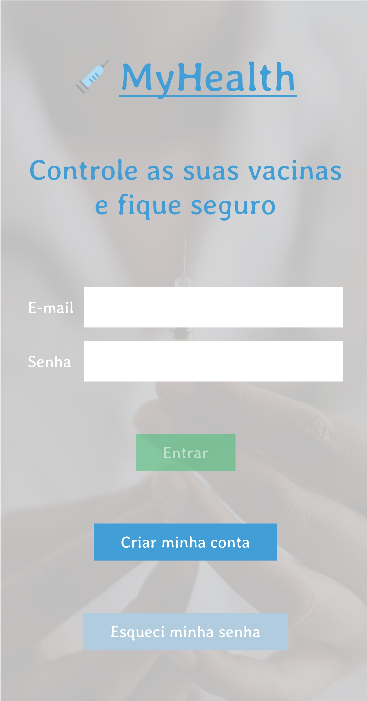
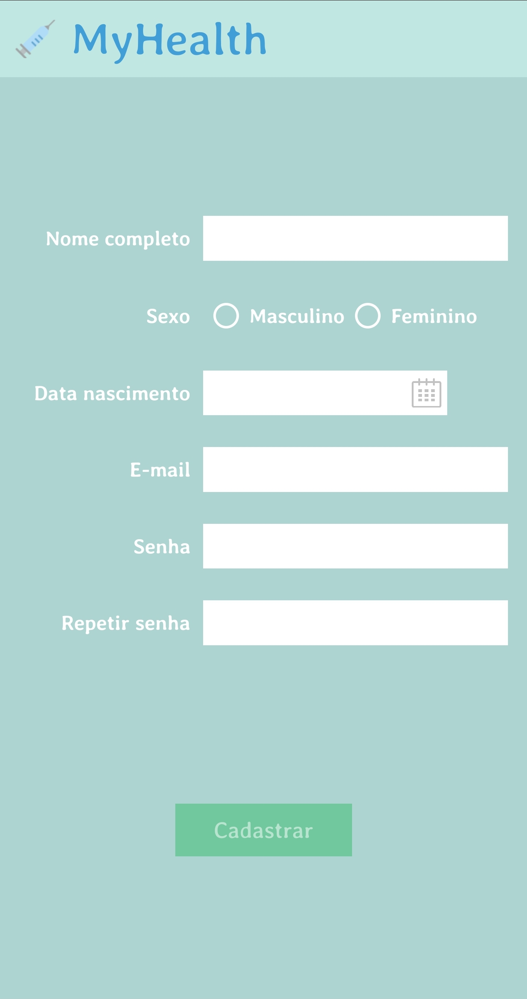
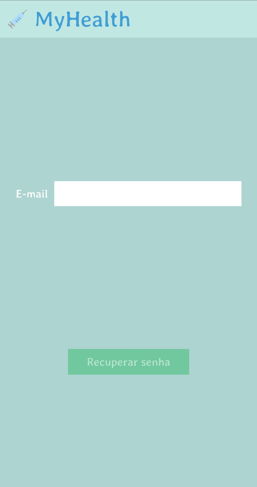
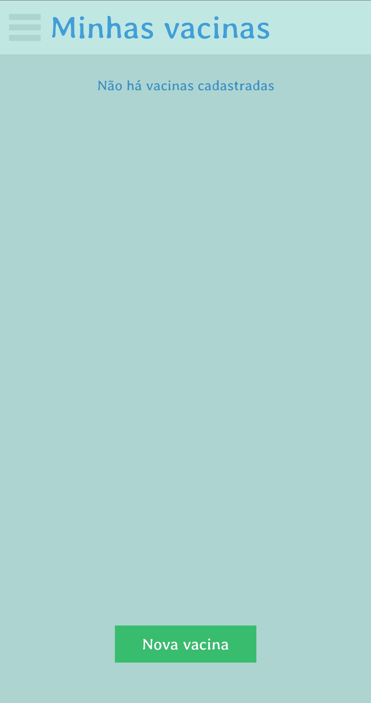
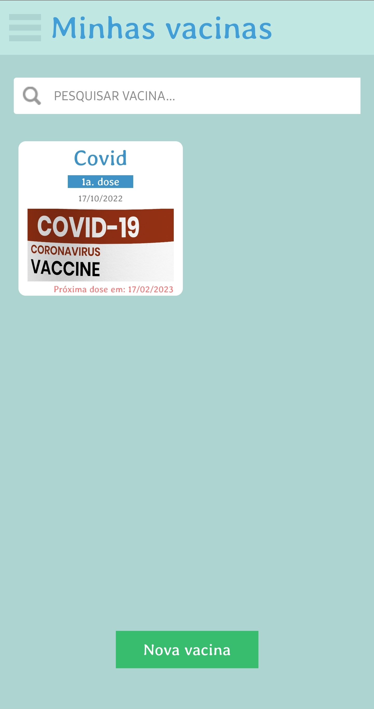
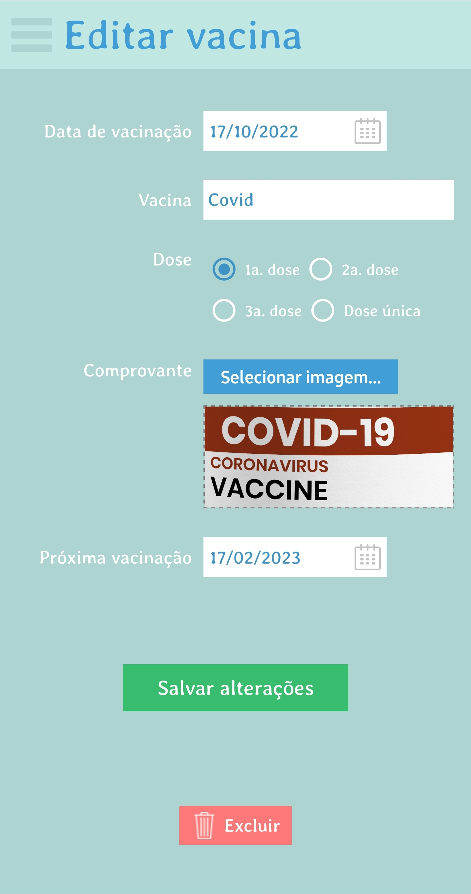
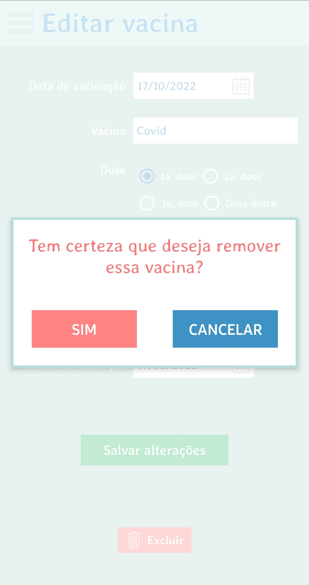
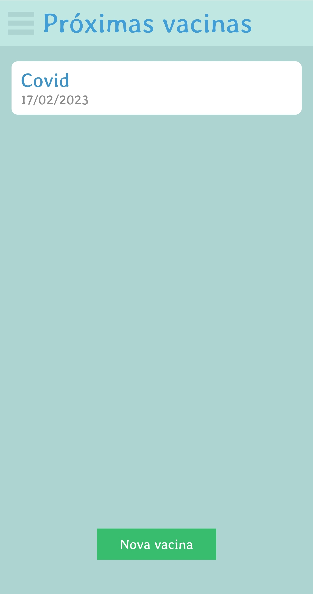

<h1 align="center">MyHealth</h1>

  

## Descrição do Projeto

Uma aplicação feita em React Native para a criação de uma carteira de vacinação digital para controlar as vacinas recebidas, incluindo a imagem do comprovante vacinal bem como as datas das próximas doses.

:syringe:

  
  
  
  
  
  
  
  
  

## :white_check_mark: Funcionalidades do projeto

- [x] Cadastro de usuário
- [x] Autenticação de usuário
- [x] Recuperação de senha
- [x] Criação/edição/exclusão de cartão de vacinas
- [x] Busca de vacinas

## Tabela de Conteúdo
<!--ts-->
   * [Descrição do Projeto](#descrição-do-projeto)
   * [Funcionalidades do projeto](#white_check_mark-funcionalidades-do-projeto)
   * [Tabela de Conteúdo](#tabela-de-conteúdo)
   * [Acesso ao projeto](#file_folder-acesso-ao-projeto)
   * [Abrir e rodar o projeto](#hammer_and_wrench-abrir-e-rodar-o-projeto)
       * [Pré-requisitos](#pré-requisitos)
       * [Rodar aplicação](#rodar-aplicação)
   * [Tecnologias utilizadas](#hash-tecnologias-utilizadas)
   * [Autor](#man_technologist-autor)
<!--te-->

## :file_folder: Acesso ao projeto

Acesse o código fonte em: [GitHub-myhealth](https://github.com/matheushenriqueferreira/myhealth)

## :hammer_and_wrench: Abrir e rodar o projeto
### Pré-requisitos

Instalar em sua máquina as seguintes ferramentas:
[Node.js](https://nodejs.org/en/) e um editor de código de sua preferência para desenvolvimento, no caso para esse projeto eu utilizei o [Visual Studio Code](https://code.visualstudio.com/).
Um celular android na versão 12 ou superior, com a depuração USB ativada ou Android studio para criar emular um sistema android.

### Rodar aplicação
    # Acesse a pasta do projeto baixado no terminal/cmd
    $ cd myhealth

    # Inicializar o metro
    $ npx react-native start

    # Instale as dependências
    $ npm install

    # Execute a aplicação
    $ npx react-native run-android

## :hash: Tecnologias utilizadas

- [Node.js](https://nodejs.org/en/)
- [Java 11 - Zulu JDK](https://www.azul.com/downloads/?package=jdk)
- [React Native](https://reactnative.dev/)
- [React Redux](https://react-redux.js.org/)
- [Redux Toolkit](https://redux-toolkit.js.org/)
- [Google Firebase](https://firebase.google.com/)
- [React Native UUID](https://www.npmjs.com/package/react-native-uuid)
- [React Native Paper - Radio Button](https://callstack.github.io/react-native-paper/radio-button.html)
- [Moment](https://momentjs.com/)
- [Date Picker](https://www.npmjs.com/package/react-native-date-picker)
- [Image Picker](https://github.com/react-native-image-picker/react-native-image-picker)
- [React Native Geolocation Sevice](https://github.com/Agontuk/react-native-geolocation-service)

## :man_technologist: Autor

| [ Matheus Henrique Ferreira](https://github.com/matheushenriqueferreira) |  
| :---: |